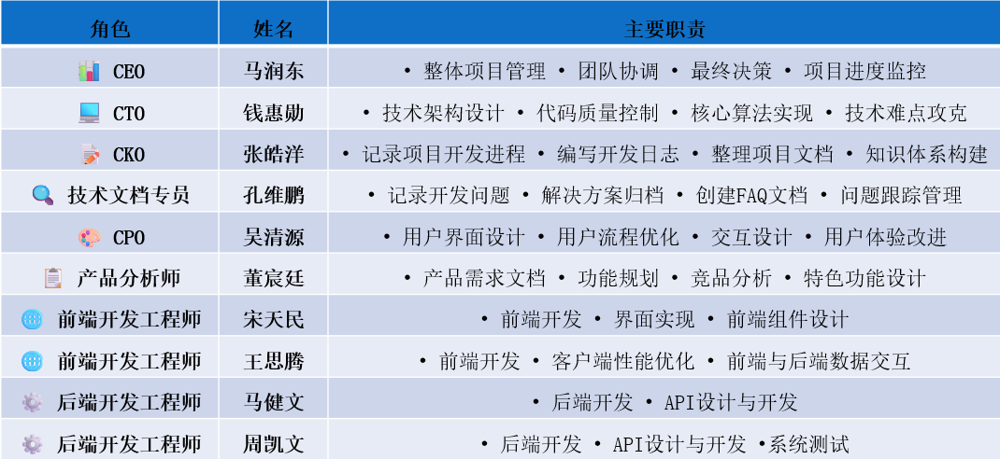

# 智能日常开支记录器

一个基于自然语言处理的智能记账应用，通过集成大型语言模型（LLM），让用户能以最自然、高效的方式完成记账和财务分析。

网站：<http://172.23.166.117:3000> (仅限校园网内访问)

## 项目概览

传统的记账应用操作流程繁琐，导致用户难以坚持。本项目旨在开发一款"智能日常开支记录器"，通过自然语言交互解决"懒人记账"的核心痛点。

### 核心特性

- **智能语音识别**: 通过自然语言输入记账信息
- **可视化报表**: 动态图表展示消费模式和趋势
- **预算管理**: 智能预算设定和进度追踪
- **响应式设计**: 适配移动端和桌面端

## 技术栈

### 前端

- **React 19.1.0** - 前端框架
- **Tailwind CSS** - CSS框架
- **Recharts** - 图表库
- **React Query** - 数据获取和状态管理
- **Axios** - HTTP客户端
- **Lucide React** - 图标库

### 后端

- **Python Flask** - 后端框架
- **Flask-CORS** - 跨域支持
- **Flask-SQLAlchemy** - ORM框架
- **SQLite** - 数据库
- **OpenAI API** - 大语言模型集成

## 项目结构

```text
ECNU-OpenSource-Team8/
├── frontend/           # React前端应用
│   ├── src/
│   │   ├── components/    # React组件
│   │   ├── pages/         # 页面组件
│   │   ├── hooks/         # 自定义hooks
│   │   ├── api/           # API接口
│   │   └── providers/     # 上下文提供者
│   └── public/         # 静态资源
├── backend/            # Flask后端应用
│   ├── app/
│   │   ├── api/          # API路由
│   │   ├── core/         # 核心功能
│   │   ├── models.py     # 数据模型
│   │   └── templates/    # HTML模板
│   └── db/            # 数据库文件
├── docs/              # 项目文档
└── TEST/              # 测试文件
```

## 快速开始

### 环境要求

- Node.js >= 16.0.0
- Python >= 3.8
- npm 或 yarn

### 安装与运行

1. **克隆项目**

   ```bash
   git clone https://github.com/ecnu-free-8/ECNU-OpenSource-Team8.git
   cd ECNU-OpenSource-Team8
   ```

2. **启动后端**

   ```bash
   cd backend
   pip install -r requirements.txt
   python run.py
   ```

3. **启动前端**

   ```bash
   cd frontend
   npm install
   npm start
   ```

4. **访问应用**

   前端: <http://localhost:3000>

   后端API: <http://localhost:5000>

## 分工情况



## 相关文档

- [产品设计文档](docs/product-design.md) - 详细的产品需求和设计规范
- [竞品分析](docs/competitive-analysis.md) - 市场竞品调研分析
- [会议记录](docs/meeting%20records/) - 项目开发过程中的会议纪要
