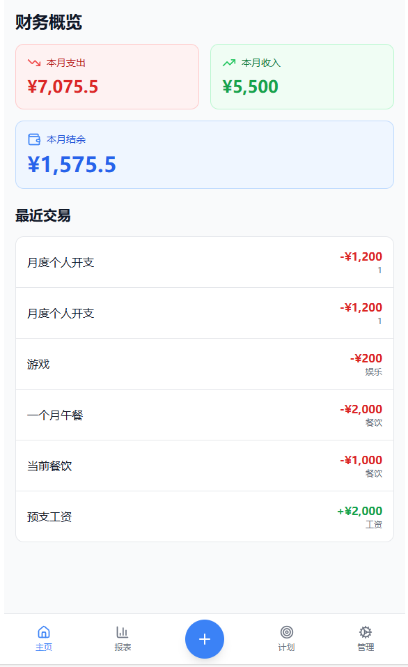
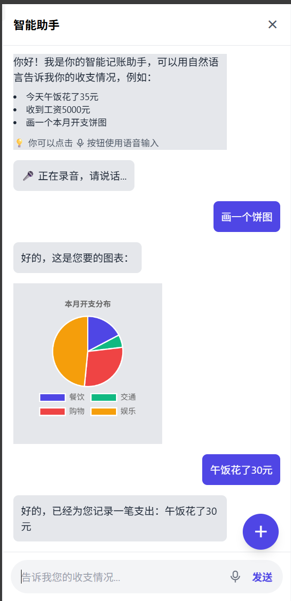
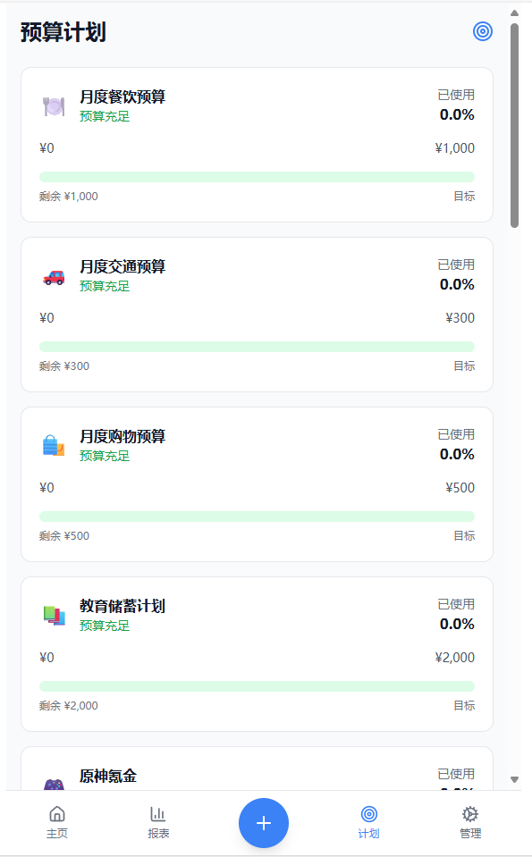

# 产品设计文档 (PRD): 智能日常开支记录器

版本: 1.3

日期: 2025年6月15日

## 1. 引言

### 1.1 项目背景

传统的记账应用操作流程繁琐，导致用户难以坚持。本项目旨在开发一款“智能日常开支记录器”，通过集成大型语言模型（LLM），利用自然语言处理技术，让用户能以最自然、高效的方式完成记账和财务分析，从而解决“懒人记账”的核心痛点。

### 1.2 产品目标

* 核心目标: 打造一款以自然语言交互为核心的智能记账工具，为用户提供概览式的主页和对话式的快捷操作入口。  
* 量化目标:  
  * 实现对用户模糊语义查询的精准理解，错误率低于10%。  
  * 提供动态、可交互的数据图表，帮助用户直观洞察消费模式。  
  * 通过预算预警和个性化建议，帮助用户提升财务规划能力。

### 1.3 目标用户画像

* 学生党: 生活费有限，追求极简操作。  
* 职场新人: 有储蓄目标，需要工具辅助培养财务习惯。  
* 自由职业者: 收入不固定，需要灵活的分类与报表。  

## 2 页面设计与用户流程 (UI/UX)

### 2.1 总体页面结构与导航

应用采用底部标签栏作为主导航，包含四个核心页面。同时，一个悬浮操作按钮作为快速记账的入口。

* 底部导航栏:  
  1. 主页: 应用启动后默认显示的页面，提供财务状况的整体概览。  
  2. 报表: 展示详细的收支分析图表。  
  3. 计划: 用户设定和追踪预算与储蓄目标的页面。  
* 悬浮操作按钮: 一个“+”号按钮，悬浮于页面之上，点击后直接进入“智能记账助手”页面。

### 2.2 用户核心流程

1. 启动应用: 用户打开应用，默认进入主页。  
2. 查看概览: 主页以卡片形式展示核心财务指标、近期交易流水和预算进度。  
3. 快速记账: 用户点击“+”号悬浮按钮，跳转至智能记账助手（聊天界面）。  
4. 自然语言输入: 用户通过文本或语音输入一笔开支。  
5. 系统处理与反馈: 系统立刻解析输入，并在聊天界面给出反馈，同时更新数据库。  
6. 返回主页: 用户完成记录，返回主页，会看到核心指标已实时更新。  
7. 深度分析: 用户点击底部导航栏进入报表或计划页面进行更详细的财务管理。

### 2.3 核心页面详解

#### 2.3.1 主页

* 顶部是核心财务摘要卡片：[本月支出 | 本月收入 | 本月结余]。  
* 中间是“预算进度”模块，用进度条展示各项主要预算的使用情况。  
* 下方是“近期交易”列表，显示最近的5-10条收支记录。  
* 页面中央有一个醒目的“+”悬浮按钮。  

显示效果:  


#### 2.3.2 智能记账助手

* 这是一个全屏的聊天界面，点击悬浮按钮后进入。  
* 顶部标题栏显示“智能助手”，并有关闭按钮。  
* 下方是文本输入框，并自动弹出键盘。  
* 支持语音输入，识别后自动将文字添加到输入框。

显示效果:  


#### 2.3.3 报表页

* 时间范围选择器: 页面顶部提供分段控件，允许用户切换时间范围，如“周”、“月”、“年”或自定义日期范围。  
* 主图表区域: 根据所选时间范围，默认展示“支出分类饼图”。图表具有交互性，点击某个扇区可以高亮显示。  
* 图表类型切换: 主图表下方提供切换按钮，如“饼图”、“柱状图”、“趋势图”，方便用户从不同维度分析。  
* 分类明细列表: 图表下方是按分类的支出/收入列表，每一项都显示分类图标、分类名称、总金额和占总数的百分比。  

显示效果:  

#### 2.3.4 计划页

* 概览卡片: 页面顶部展示总预算和总储蓄目标的完成情况。  
* 列表展示: 以列表形式展示所有进行中的预算和储蓄计划。  
* 计划卡片: 每个计划都是一张卡片，内容包括：  
  * 计划名称（如“餐饮预算”、“日本旅行基金”）。  
  * 金额信息（如“¥350 / ¥800”或“¥6,000 / ¥20,000”）。  
  * 一个醒目的进度条，直观展示当前进度。  
  * 剩余时间或截止日期。  
* 添加按钮: 页面右上角有一个“+”按钮，用于创建新的预算或储蓄计划。

显示效果:  


## 3. 功能规格

### 3.1 核心交互：LLM意图解析与结构化输出

核心原则: 所有在“智能记账助手”页面中的自然语言输入，都将首先由LLM进行意图识别和实体提取，并输出为结构化的JSON。后端服务器只处理这个标准化的JSON。

JSON输出格式定义(暂定):

1. 意图: RECORD_TRANSACTION (记录交易)  
   * 用户输入: “今天午饭花了20元”  
   * JSON输出:  

    ```json
     {  
       "intent": "RECORD_TRANSACTION",  
       "entities": {  
         "amount": 20.0,  
         "category": "餐饮",  
         "description": "午饭",  
         "date": "2025-06-15",  
         "type": "expense"  
       }  
     }
    ```

2. 意图: QUERY_DATA (查询数据)  
   * 用户输入: “这个月奶茶花了多少？”  
   * JSON输出:  

    ```json
     {  
       "intent": "QUERY_DATA",  
       "entities": {  
         "query_type": "sum",  
         "time_range": { "start": "2025-06-01", "end": "2025-06-30" },  
         "filters": [  
           {"field": "description", "operator": "contains", "value": "奶茶"}  
         ]  
       }  
     }
    ```

3. 意图: SET_BUDGET (设定预算)  
   * 用户输入: “这个月餐饮预算200元”  
   * JSON输出:  

    ```json
     {  
       "intent": "SET_BUDGET",  
       "entities": {  
         "category": "餐饮",  
         "amount": 200.0,  
         "time_period": "month",  
         "date": "2025-06"  
       }  
     }
    ```

4. 意图: DRAW_CHART (绘制图表) (新增功能)  
   * 功能描述: 允许用户用自然语言描述一个图表，LLM负责生成渲染该图表所需的配置。  
   * 用户输入: “画一个最近三个月，每个月餐饮和购物开销的柱状图”  
   * JSON输出:  

   ```json
     {  
       "intent": "DRAW_CHART",  
       "chart_config": {  
         "type": "bar", // 图表类型  
         "data": {  
           "labels": ["四月", "五月", "六月"], // X轴标签  
           "datasets": [  
             {  
               "label": "餐饮",  
               "data": [/* SQL查询出的数据 */]  
             },  
             {  
               "label": "购物",  
               "data": [/* SQL查询出的数据 */]  
             }  
           ]  
         },  
         "options": { // Chart.js的配置项  
           "responsive": true,  
           "title": {  
             "display": true,  
             "text": "近三月餐饮与购物开销对比"  
           }  
         }  
       }  
     }
    ```

   * 后端行为:  
     1. 接收到intent为DRAW_CHART的JSON。  
     2. 后端解析chart_config，识别出需要查询的数据（如餐饮和购物的月度总和）。  
     3. 执行相应的SQL查询，填充data字段中的数据。  
     4. 将完整的chart_config JSON对象返回给前端。  
     5. 前端使用Chart.js库，根据这个配置对象直接渲染出图表。

## 4. 非功能性需求

* 隐私与安全: 所有用户数据默认存储在本地设备的SQLite数据库中。  
* 性能: 本地操作响应时间应低于500毫秒。  
* 易用性: 以概览页和对话式为核心交互，降低用户学习成本。

## 5. 系统架构与技术栈

* 前端: HTML (Flask模板), JavaScript, Chart.js。  
* 后端: Python + Flask 框架。  
* 数据库: SQLite。  
* 核心模块: LLM 模块，作为自然语言到结构化JSON的转换层。

## 6. 数据库设计与语句参考

### 6.1 表结构设计

#### 6.1.1 开支表 (expenses)  

* 用于存储每一笔收入和支出记录。
* 由于 sqlite 限制，没有专用的时间类型，此处使用其最佳实践 text 类型

| 字段名 | 数据类型 | 约束 | 描述 |
| :---- | :---- | :---- | :---- |
| id | INTEGER | PRIMARY KEY | 唯一标识符 |
| amount | REAL | NOT NULL | 金额 |
| type | TEXT | NOT NULL | 类型 ('expense', 'income') |
| category | TEXT | NOT NULL | 分类 (如'餐饮', '交通') |
| description | TEXT |  | 具体描述 |
| transaction_date | TEXT | NOT NULL | 交易日期 (格式: 'YYYY-MM-DD HH:MM:SS') |

#### 6.1.2 计划表 (plans)  

用于存储用户的预算和储蓄目标。

| 字段名 | 数据类型 | 约束 | 描述 |
| :---- | :---- | :---- | :---- |
| id | INTEGER | PRIMARY KEY | 唯一标识符 |
| name | TEXT | NOT NULL | 计划名称 (如'月度餐饮预算') |
| type | TEXT | NOT NULL | 计划类型 ('budget', 'saving') |
| target_amount | REAL | NOT NULL | 目标金额 |
| current_amount | REAL | DEFAULT 0 | 当前已用/已存金额 |
| category_linked | TEXT |  | 关联的开支分类 (仅对budget有效) |
| start_date | TEXT | NOT NULL | 计划开始日期 |
| end_date | TEXT | NOT NULL | 计划结束日期 |

#### 6.2 常用SQL语句参考

* 记录一笔新的开支:  

```sql
  INSERT INTO expenses (amount, type, category, description, transaction_date)  
  VALUES (25.5, 'expense', '餐饮', '午餐', '2025-06-15 12:30:00');
```

* 查询本月（2025年6月）所有支出总额:  

```sql
  SELECT SUM(amount) FROM expenses  
  WHERE type = 'expense' AND strftime('%Y-%m', transaction_date) = '2025-06';
```

* 查询本月按分类汇总的支出（用于生成饼图）:  

```sql
  SELECT category, SUM(amount) as total  
  FROM expenses  
  WHERE type = 'expense' AND strftime('%Y-%m', transaction_date) = '2025-06'  
  GROUP BY category  
  ORDER BY total DESC;
```

* 创建一个新的月度餐饮预算:  

```sql
  INSERT INTO plans (name, type, target_amount, category_linked, start_date, end_date)  
  VALUES ('月度餐饮预算', 'budget', 800.0, '餐饮', '2025-06-01', '2025-06-30');
```

* 当一笔餐饮开支发生后，更新预算进度:  

```sql
  UPDATE plans  
  SET current_amount = current_amount + [新开支金额]  
  WHERE category_linked = '餐饮' AND type = 'budget' AND '2025-06-15' BETWEEN start_date AND end_date;  
```
